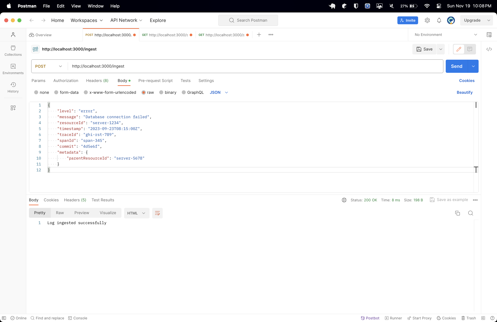
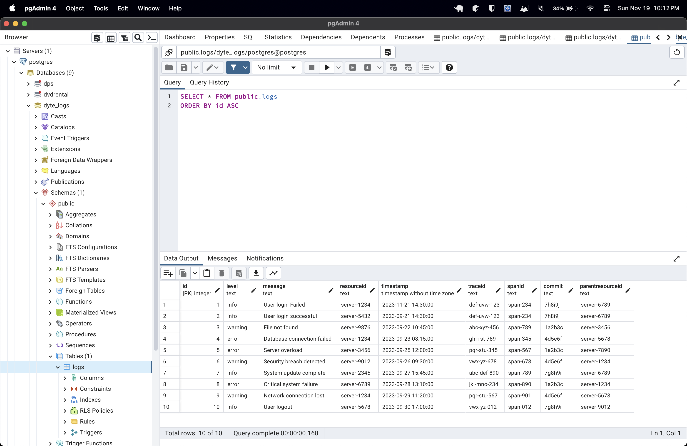
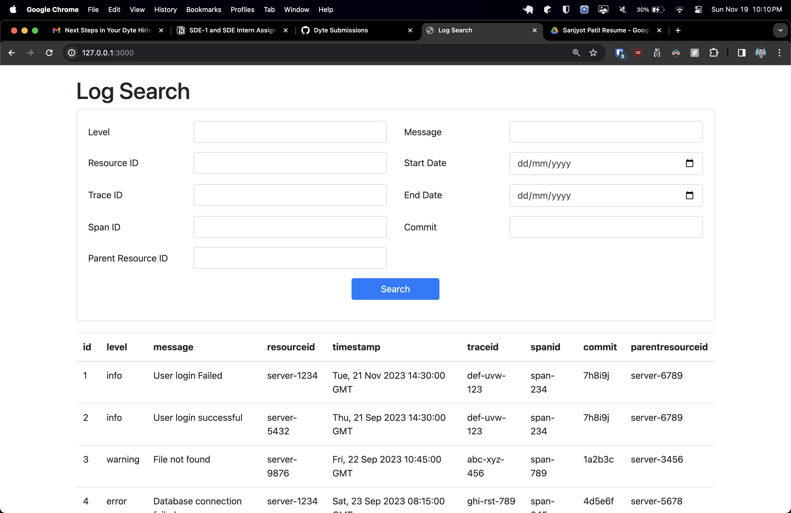
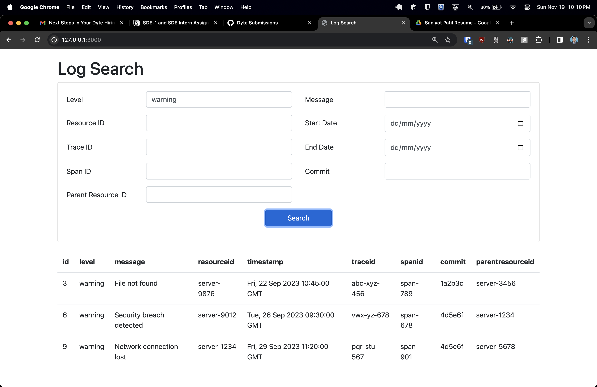
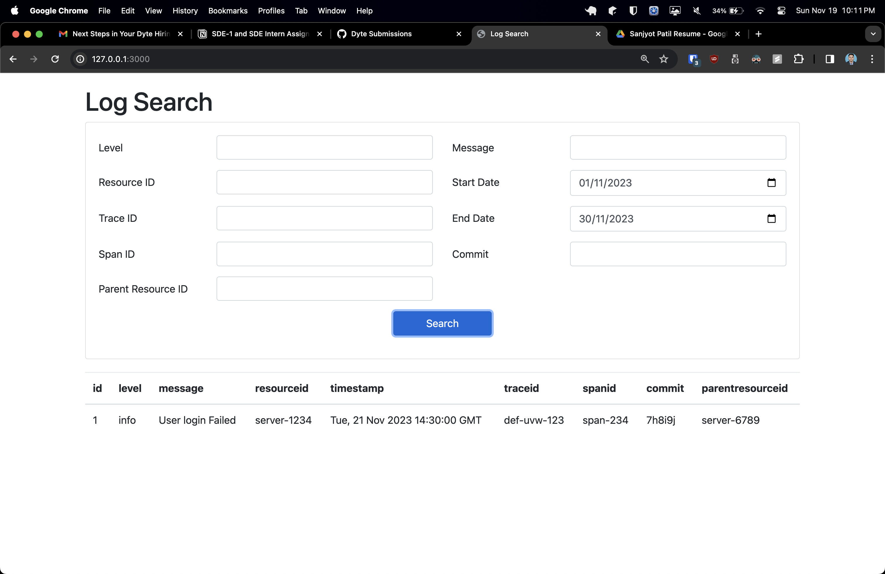
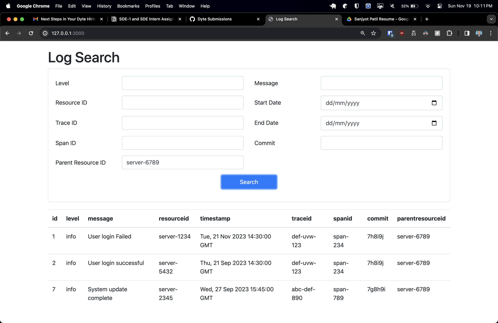

# Log Search App

## Description

This app ingests logs over HTTP on port 3000 and provides a search interface to query the logs. 

It is built to handle high volumes of log data efficiently and offer fast search capabilities.

<br>
<p align="center">
  
   
  
  
</p>

<p align="center">
  
  
  
</p>

### Features

- **Log Ingestor**

  - Ingests logs in the specified JSON format
  - Scalable to handle large volumes   
  - Optimized for efficient writes
  - Exposes HTTP endpoint on port 3000

- **Search Interface**

  - Full text search on logs
  - Filter by:
    - Level
    - Message 
    - Resource ID
    - Timestamp
    - Trace ID
    - Span ID
    - Commit
    - Parent Resource ID
  - Date range filters
  - Fast and efficient search

### Tech Stack

- Python, Flask for backend APIs
- PostgreSQL for storage
- HTML, CSS, JavaScript for frontend UI

## Getting Started

### Prerequisites

- Python 3.12
- PostgreSQL

### Installation

1. Install dependencies

   ```
   pip install -r requirements.txt
   ```

2. Configure PostgreSQL database and configure credentials in app.py 
   
   ```
   Create database 'dyte_logs' in postgres
   ```
   
   configure following properties in app.py
   
   ```
    conn = psycopg2.connect(
        dbname='dyte_logs',
        user='postgres',
        password='1234',
        host='localhost',
        port='5432'
    )
   ```
   
3. Start backend server

   ```
   python app.py
   ```
   
4. Ingest sample logs using postman over `http://localhost:3000/ingest`

   ```
      {
       "level": "info",
       "message": "User logout",
       "resourceId": "server-5678",
       "timestamp": "2023-09-30T17:00:00Z",
       "traceId": "vwx-yz-012",
       "spanId": "span-012",
       "commit": "7g8h9i",
       "metadata": {
           "parentResourceId": "server-9012"
       }
   }
   ```

5. Open `http://127.0.0.1:3000/` in browser for frontend

## Usage

After starting the Flask server, you can ingest logs via the `/ingest` endpoint and then search/filter logs via the frontend UI.

Sample log:

```
{
  "level": "info",
  "message": "User login",
  "resourceId": "server-1234",
  "timestamp": "2023-02-14T12:00:00Z",
  "traceId": "abcd1234", 
  "spanId": "span-001",
  "commit": "a1b2c3",
  "metadata": {
     "userId": "user-5678" 
  }
}
```

## Known Issues

- Flask server can become bottleneck under high load
- Needs more testing for peak loads

## Contributing

Pull requests are welcome. For major changes, please open an issue first to discuss what you would like to change.

## License

[MIT](https://choosealicense.com/licenses/mit/)

<!-- CONTACT -->
## Contact

Sanjyot Patil - [linkedin](https://www.linkedin.com/in/sanjyot-patil-576844198/) 
                [Email](mailto:sanjyot789@gmail.com)


